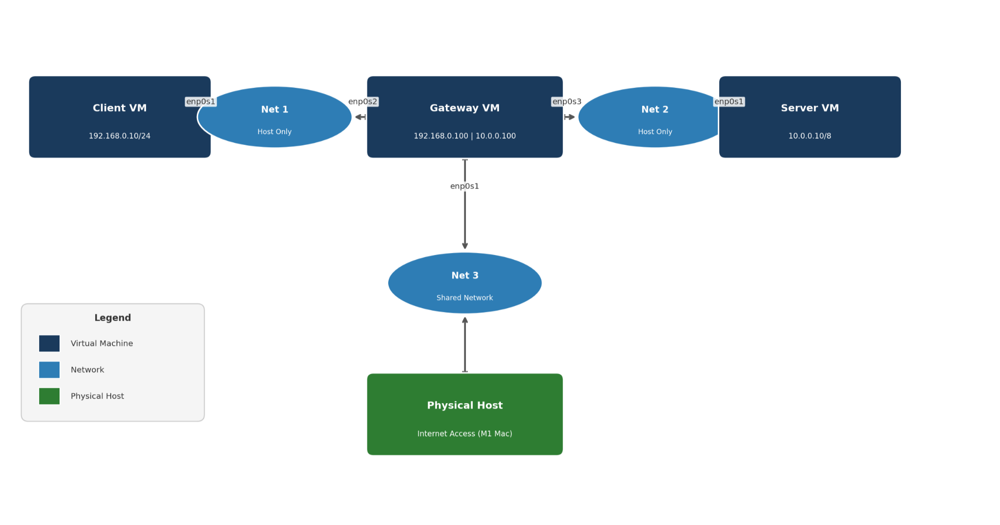

# Network Security Lab: Firewall, NAT & Intrusion Detection

An end-to-end lab that builds an isolated multi-VM network, hardens it with a Linux firewall, and monitors it with a Snort intrusion detection system. The project moves through three stages — **build → defend → detect** — mirroring how a real network is stood up, secured, and watched.

> Built as a three-part project sequence for a computer network security course. Each stage builds on the same virtual network from the stage before it.

## Network Topology

A gateway VM routes between two isolated internal networks — a **client** network (192.168.0.0/24) and a **server** network (10.0.0.0/8) — and reaches the internet through a NAT interface. All traffic between client and server is forced through the gateway, where the firewall and IDS live.

## What This Demonstrates

| Stage | Focus | Key work |
| --- | --- | --- |
| **1. Network Setup** | Infrastructure | Built 3 VMs (client, gateway, server) across segmented internal networks with static routing and NAT-based internet access. |
| **2. Firewall & NAT** | Prevention | Whitelist `iptables` firewall (default-DROP), DNAT port forwarding for HTTP/SSH/FTP, and POSTROUTING masquerading. |
| **3. Intrusion Detection** | Detection | Nine custom Snort signatures detecting DoS attacks and port scans, validated by deploying each attack with `hping3`/`nmap`. |

Together these show both sides of network defense: **prevention** (blocking unwanted traffic at the firewall) and **detection** (alerting on malicious traffic that a monitored gateway can see) — the two core layers of a defense-in-depth posture.

## Tech Stack

- **OS / Virtualization:** Ubuntu 22.04 LTS guests, [VirtualBox / UTM — whichever you actually used]
- **Firewall & NAT:** iptables (filter + nat tables)
- **Intrusion Detection:** Snort (signature-based rules, threshold detection)
- **Attack & validation tooling:** hping3, nmap
- **Services under test:** Apache2 (HTTP), vsftpd (FTP), OpenSSH (SSH)
- **Networking:** netplan, static routing, DNAT/SNAT

## Repository Structure

- [`01-network-setup/`](01-network-setup/) — building the isolated VM network, interfaces, routing, and NAT
- [`02-firewall-nat/`](02-firewall-nat/) — the iptables whitelist firewall, port forwarding, and masquerading, with the rule script
- [`03-intrusion-detection/`](03-intrusion-detection/) — the Snort configuration and the nine custom detection rules (`local.rules`)
- [`diagrams/`](diagrams/) — network topology diagram

Each stage folder has its own README summarizing what was done and what it taught, alongside the report and the actual config files.

## Key Takeaways

A few things this lab made concrete:

- **Least privilege in practice.** A default-DROP firewall means every allowed path is deliberate — return traffic only works because of explicit connection-state tracking, not by accident.
- **NAT is both plumbing and a boundary.** DNAT forwarding lets the client reach services only through the gateway's IP; the server's real address stays hidden behind masquerading.
- **Threshold detection keeps IDS usable.** Without it, a single SYN flood would bury the logs in thousands of alerts; thresholds trade a little sensitivity for signal you can actually read.
- **Signature-based detection has a ceiling.** These rules catch known patterns — a modified attack could slip past, which is exactly why signatures need constant updating.

## Author

Anuj Tummalapally
